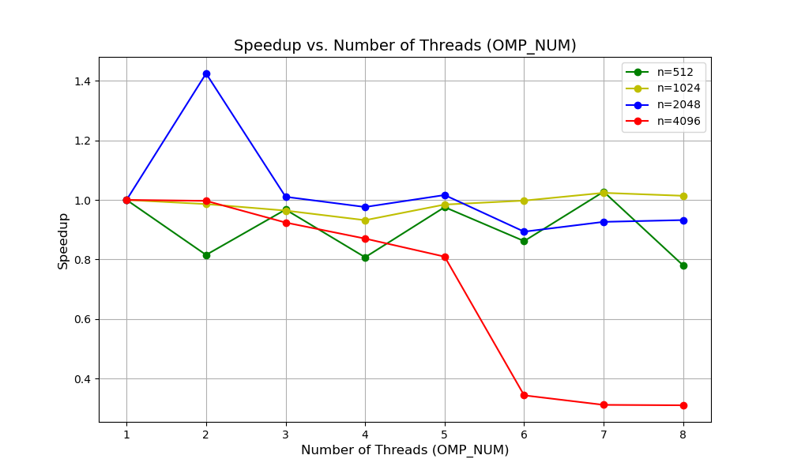

# TD1

`pandoc -s --toc README.md --css=./github-pandoc.css -o README.html`

## lscpu

*lscpu donne des infos utiles sur le processeur : nb core, taille de cache :*

```
Coller ici les infos *utiles* de lscpu.
```


## Produit matrice-matrice

### Effet de la taille de la matrice

  n            | MFlops
---------------|--------
1023           |1555.96
1024 (origine) |469.785
1025           |1492.98

*Expliquer les résultats.*
Les caches des CPU modernes utilisent la stratégie de `mappage associatif par ensembles (Set-Associative)`. Lorsque la dimension d'une matrice est une puissance de 2, les données des lignes voisines peuvent être mappées dans le même ensemble de cache en raison de l'alignement des adresses mémoire, entraînant des remplacements fréquents des lignes de cache.
Du coup il peut y avoir des conflits miss.
### Permutation des boucles

*Expliquer comment est compilé le code (ligne de make ou de gcc) : on aura besoin de savoir l'optim, les paramètres, etc. Par exemple :*
On change l'ordre des boucles, sauvegarde, et puis `make TestProductMatrix.exe` encore une fois.
`make TestProduct.exe && ./TestProduct.exe 1024`


  ordre           | time    | MFlops  
------------------|---------|---------
i,j,k (origine)   | 0.415599| 5152.07 
j,i,k             | 0.482407| 4438.57 
i,k,j             | 1.37612 | 1555.96 
k,i,j             | 1.42673 | 1500.77 
j,k,i             | 0.331083| 6467.26 
k,j,i             | 0.289661| 7392.09 


*Discuter les résultats.*
Pour l'ordre k,j,i:
Réutilisation des données dans les blocs : Le sous-bloc de B reste en cache, et A ainsi que C accèdent aux données par des sauts de petite taille, ce qui permet d'optimiser la localité.


### OMP sur la meilleure boucle

`make TestProduct.exe && OMP_NUM_THREADS=8 ./TestProduct.exe 1024`

  OMP_NUM         | MFlops  | MFlops(n=2048) | MFlops(n=512)  | MFlops(n=4096)
------------------|---------|----------------|----------------|---------------
1                 | 942.677 | 606.798        | 2853.74        | 426.883
2                 | 929.505 | 864.573        | 2326.51        | 425.539
3                 | 908.884 | 613.113        | 2761.13        | 394.406
4                 | 878.446 | 592.328        | 2303.73        | 371.406
5                 | 927.929 | 616.738        | 2784.53        | 345.51
6                 | 940.5   | 542.057        | 2458.84        | 146.577
7                 | 965.041 | 562.063        | 2932.34        | 132.925
8                 | 955.735 | 565.705        | 2225.78        | 132.347

*Tracer les courbes de speedup (pour chaque valeur de n), discuter les résultats.*


Globalement, ces fluctuations de performance sont normales dans les calculs multithread, en particulier en fonction de la taille des matrices et du nombre de threads. La performance n'augmente pas toujours de manière linéaire avec le nombre de threads, car elle peut être affectée par des facteurs tels que la concurrence pour les ressources, les coûts de planification des threads, etc.

### Produit par blocs

`make TestProduct.exe && ./TestProduct.exe 1024`

  szBlock         | MFlops  | MFlops(n=2048) | MFlops(n=512) 
------------------|---------|----------------|---------------
origine (=max)    | 957.333 | 576.398        | 2671.23
32                | 929.798 | 600.021        | 2059.19     
64                | 919.851 | 621.266        | 2851.11
128               | 969.841 | 587.102        | 2754.5
256               | 969.475 | 615.616        | 2861.16
512               | 952.256 | 825.964        | 2952.12
1024              | 976.807 | 599.83         | 2861

*Discuter les résultats.*
C'est un enjeu pour la vitesse:
1. Plus le bloc est petit, plus la calculation de chaque bloc est rapide.
2. Plus le bloc est petit, plus le nombre des blocs, donc moins de vitesse pour les assembler.
En conclusion, selon le résultat, il existe un optim du szBlock pour que le résultat soit le meilleur.

### Bloc + OMP


  szBlock      | OMP_NUM | MFlops  | MFlops(n=2048) | MFlops(n=512)  
---------------|---------|---------|----------------|----------------
1024           |  1      | 933.687 | 627.846        | 3058.45       
1024           |  8      | 957.962 | 617.107        | 3029.9       
512            |  1      | 909.649 | 598.432        | 2901.34      
512            |  8      | 963.369 | 620.103        | 2624.49      

*Discuter les résultats.*
Choix de la taille des blocs : En général, des blocs plus grands (comme 1024) donnent de meilleures performances, surtout quand on travaille avec un seul thread, car ils exploitent mieux le cache.
Par contre, des blocs plus petits (comme 512) peuvent parfois ralentir les choses, parce qu'ils entraînent plus de défauts de cache.

Effet du multithreading : Le multithreading (par exemple avec OMP_NUM=8) peut améliorer les performances dans certains cas, mais parfois, à cause de la synchronisation entre les threads et de la concurrence pour les ressources, ça n'apporte pas vraiment de gains, voire ça ralentit.
Le nombre idéal de threads dépend des caractéristiques du matériel (comme le nombre de cœurs, la bande passante mémoire et la structure du cache). Si tu mets trop de threads, ça peut même entraîner des frais supplémentaires et réduire les performances.

### Comparaison avec BLAS, Eigen et numpy

*Comparer les performances avec un calcul similaire utilisant les bibliothèques d'algèbre linéaire BLAS, Eigen et/ou numpy.*
Pour numpyet BLAS, il peuvent faire le production de 2 matrice de dimension 1024 avec un ODG 10^6 Mflops. C'est beaucoup plus vite.

En conclusion, dans ce TP, j'ai rencontré un problème. Les résultats obtenus en exécutant le code plusieurs fois avec les mêmes paramètres varient considérablement, parfois même plus que ceux obtenus avec des paramètres différents, ce qui rend difficile l'analyse de l'impact de certains paramètres sur le code.

# Q2

Time: Unity(s)

      | OPENMP |   MPI   | Mpi4py 
------|--------|---------|--------
 n=1  |0.019772| 0.021420|0.203326
 n=2  |0.097825| 0.011216|0.101224
 n=4  |0.019393| 0.008644|0.058349
 n=8  |0.011042| 0.005018|0.037181

*******************************************
Speedup:

      | OPENMP |   MPI   | Mpi4py 
------|--------|---------|--------
 n=1  | 1      | 1       | 1       
 n=2  | 0.202  | 1.910   | 2.009
 n=4  | 1.020  | 2.478   | 3.485
 n=8  | 1.791  | 4.269   | 5.469

